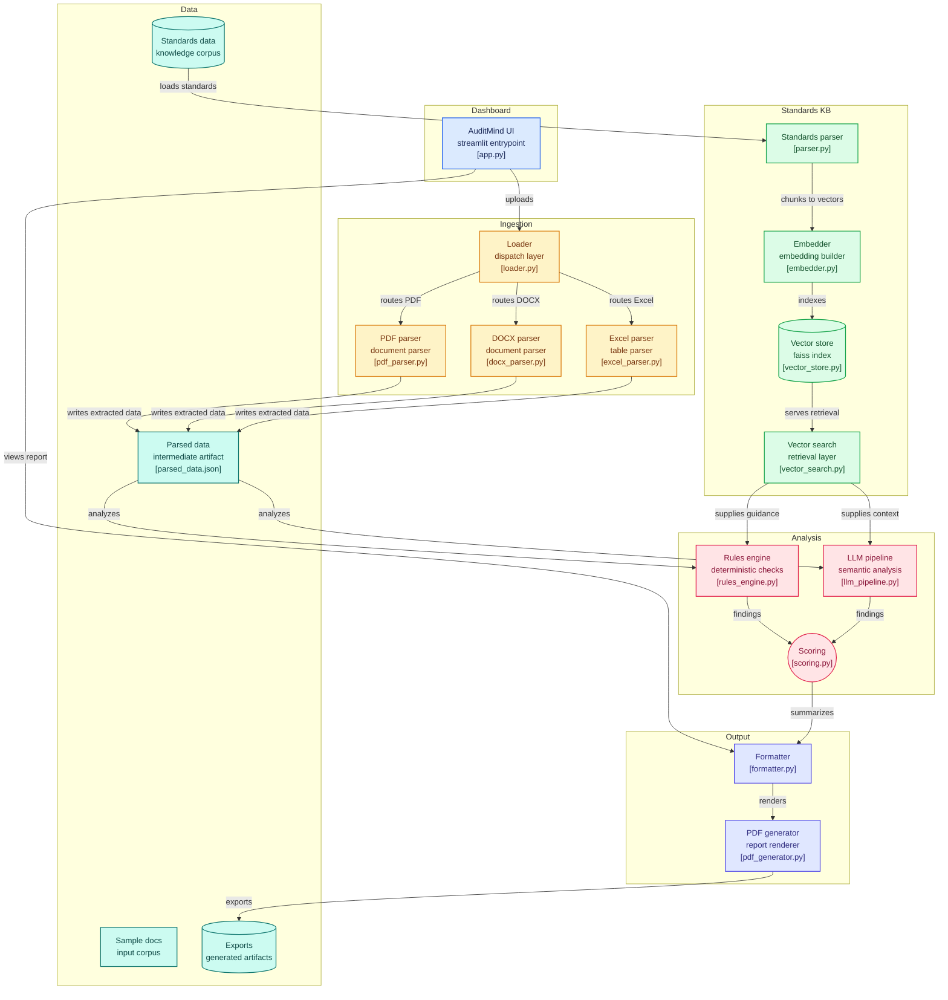

# AuditMind 📊
an ai assisstant that drafts audit memos and checks IFRS/IAS compliance from financial statements


---

## what is AuditMind?

AuditMind is an AI assisstant designed to help auditors by **automatically drafting audit summaries** from client financial statements while checking compliance againt **IFRS/IAS accounting standards**

it generates structured memos highlighting risks, red flags, and missing disclosures, with citations to the releavent standards

---

## why it matters?

auditors spend countless hours manually reading financial statements and cross-checking against complex IFRS/IAS rules

AuditMind **saves time, improves consistency, and ensures tracebility** by linking findings directly to the applicable accounting standards

---

## how does it work?

1. **upload the document :** financial statments in PDF, excel or word

2. **parse & structure data :** core/ingestion handles extraction of tables and text

3. **standards retrieval :** IFRS/IAS paragraphs are embedded and stored in FAISS for fast retrieval

4. **analysis & rule checking:** hybrid LLM + python rules engine checks compliance, identifies red flags, and score risk

5. **memo generation:** produces structured JSON and a polished PDF memo

6. **interactive dashboard:** display findings, compliance scores, and allows memo download

---

## tech stack

- parsing : `pdfplumber`, `python-docx`, `openpyxl` 

- embeddings + vector DB : `sentence-transformers`, `faiss-cpu` 

- LLM : `transformers`, `torch`

- PDF export : `reportlab`

- dashboard : `streamlit`

---

## example

**query:** check IFRS 16 (leases) for apple in 2022

**output:**

- missing discount rate disclosure (IFRS 16, paragraph 26)

- red flag: impairement test not reported

- risk level: medium

---

## quickstart

1. clone the repo

```bash

git clone https://github.com/Youcef3939/AuditMind.git
cd AuditMind
```

2. create a virtual environment
```
python -m venv venv

source venv/bin/activate # linux/mac
```
venv\Scripts\activate # windows

3. install dependencies
```
pip install -r requirements.txt
```

4. run the dashboard

```
streamlit run dashboard/app.py
```

5. upload a financial statement, lean back and watch AuditMind work its magic!

---

## diagram



---

## why was AuditMind born?

auditing is one of the most time intensive and repetitive parts of financial work

auditors spend endless hours reading financial statements, cross-checking IFRS/IAS standards and drafting memos; a process that is

- manual: high risk of oversight and inconsistencies

- repetetive: same checks done over and over again

- complex: IFRS/IAS standards run into thousands of pages

i asked myself this question; what if auditors had an assisstant that could do the heavy lifting, parsing financials, retrieving relevant standards, and drafting structured memos whole leaving the judgment calls to humans?

that's how AuditMind was born: a free open source ai assisstant that gives auditors **speed**, **accuracy**, and **tracebility** without replacing professional judgment

---

## contributing

- fork the repo & submit PRs

- add sample financiall statements for testing

- suggest additional IFRS/IAS rules or enhancements

---

AuditMind isn't just another AI project

it's built on the belief that auditors deserve smarter tools and clients deserve clearer trust

> AuditMind - because accuracy isn't optional
